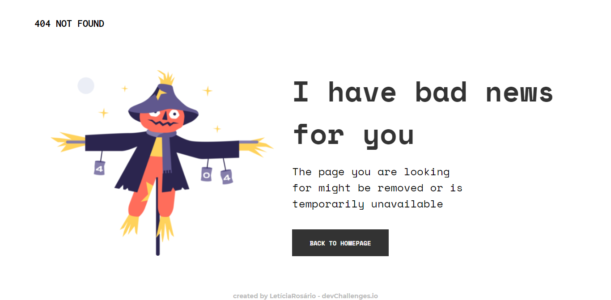

<!-- Please update value in the {}  -->

<h1 align="center">404 NOT FOUND</h1>

   Solution for a challenge from  <a href="http://devchallenges.io" target="_blank">Devchallenges.io</a>.

  <h3>
    <a href="https://leticiarosario.github.io/404notfound/">
      Demo
    </a>
     | 
    <a href="https://devchallenges.io/solutions/q2RMDWv8Lur7qKVevC9W">
      Solution
    </a>
     | 
    <a href="https://devchallenges.io/challenges/wBunSb7FPrIepJZAg0sY">
      Challenge
    </a>
  </h3>

<!-- TABLE OF CONTENTS -->

## Table of Contents

- [Overview](#overview)
  - [Built With](#built-with)
- [Features](#features)
- [Contact](#contact)
- [Acknowledgements](#acknowledgements)

<!-- OVERVIEW -->

## Overview

The demo can be found at in this locate [404notfound](https://leticiarosario.github.io/404notfound/), with this I applied my experiences, used the css flex box

### Built With

<!-- This section should list any major frameworks that you built your project using. Here are a few examples.-->

- [Html5](https://www.w3schools.com/html/)
- [Css3](https://www.w3schools.com/css/default.asp)

## Features

<!-- List the features of your application or follow the template. Don't share the figma file here :) -->

This application/site was created as a submission to a [DevChallenges](https://devchallenges.io/challenges) challenge. The [challenge](https://devchallenges.io/challenges/wBunSb7FPrIepJZAg0sY) was to build an application to complete the given user stories.

## Acknowledgements

<!-- This section should list any articles or add-ons/plugins that helps you to complete the project. This is optional but it will help you in the future. For exmpale -->

- [Steps to replicate a design with only HTML and CSS](https://devchallenges-blogs.web.app/how-to-replicate-design/)
- [Node.js](https://nodejs.org/)
- [Marked - a markdown parser](https://github.com/chjj/marked)

## Contact

- GitHub [@leticiarosario](https://github.com/Leticiarosario)
- Twitter [@leticia](https://twitter.com/Leticia29785481)
